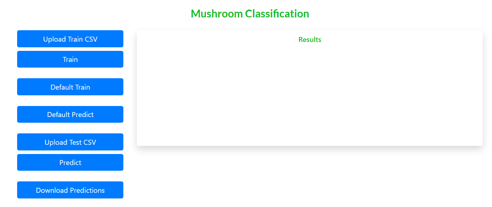

# MushroomClassification
Detect the poisonous mushroom using its physical characteristics.


## Table of Contents
* [General Info](#general-information)
* [Data Description](#data-description)
* [Libraries](#libraries)
* [Screenshots](#screenshots)
* [Setup](#setup)
* [Usage](#usage)
* [Contact](#contact)
* [License](#license)


## General Information
The goal is to build a machine learning model which predicts whether a mushroom is edible or 
poisonous based on the characteristics. There are two classes: ‘e’ and ‘p’. 
- ‘e’ means that the mushroom is edible.
- ‘p’ means that the mushroom is poisonous. 


## Data Description
This dataset describes mushrooms in terms of their physical characteristics
- cap-shape: bell=b,conical=c,convex=x,flat=f, knobbed=k,sunken=s
- cap-surface: fibrous=f,grooves=g,scaly=y,smooth=s
- cap-color: brown=n,buff=b,cinnamon=c,gray=g,green=r, 
pink=p,purple=u,red=e,white=w,yellow=y
- bruises?: bruises=t,no=f
- odor: almond=a,anise=l,creosote=c,fishy=y,foul=f, musty=m,none=n,pungent=p,spicy=s
- gill-attachment: attached=a,descending=d,free=f,notched=n
- gill-spacing: close=c,crowded=w,distant=d
- gill-size: broad=b,narrow=n
- gill-color: black=k,brown=n,buff=b,chocolate=h,gray=g, 
green=r,orange=o,pink=p,purple=u,red=e, white=w,yellow=y
- stalk-shape: enlarging=e,tapering=t
- stalk-root: bulbous=b,club=c,cup=u,equal=e, rhizomorphs=z,rooted=r,missing=?
- stalk-surface-above-ring: fibrous=f,scaly=y,silky=k,smooth=s
- stalk-surface-below-ring: fibrous=f,scaly=y,silky=k,smooth=s
- stalk-color-above-ring: brown=n,buff=b,cinnamon=c,gray=g,orange=o, 
pink=p,red=e,white=w,yellow=y
- stalk-color-below-ring: brown=n,buff=b,cinnamon=c,gray=g,orange=o, 
pink=p,red=e,white=w,yellow=y
- veil-type: partial=p,universal=u
- veil-color: brown=n,orange=o,white=w,yellow=y
- ring-number: none=n,one=o,two=t
- ring-type: cobwebby=c,evanescent=e,flaring=f,large=l, 
none=n,pendant=p,sheathing=s,zone=z
- spore-print-color: black=k,brown=n,buff=b,chocolate=h,green=r, 
orange=o,purple=u,white=w,yellow=y
- population: abundant=a,clustered=c,numerous=n, scattered=s,several=v,solitary=y
- habitat: grasses=g,leaves=l,meadows=m,paths=p, urban=u,waste=w,woods=d

Data is available as multiple sets of files. Each file will contain physical characteristics and a 
column to indicate whether it is edible [‘e’] or not [‘p']. Apart from data files, schema files are 
provided as a part of Data Sharing Agreement which contains all the relevant information about 
both train and test data such as:
- File name convention
- No of columns in each file
- Data type of each column
- Name of the columns


## Libraries
- Application Framework - flask, wsgiref
- Database operations - sqlite3
- Data processing and ML - numpy, pandas, matplotlib, sklearn, xgboost, kneed, pickle, seaborn
- General operations - os, shutil, csv, json, re, datetime, time


## Screenshots



## Setup
Clone this repo using
```sh
git clone https://github.com/Anil-45/MushroomClassification.git
```

Install the required modules using
```sh
pip install -r requirements.txt
```


## Usage

Run the following command to start the application
```bash
python app.py
```

Open the [application](http://127.0.0.1:5000/)

- `Upload Train CSV` use this option to upload custom training files
- `Train` trains the model the using uploaded training files
- `Default Train` trains the model using default files. Make sure the data files are present in _`data/raw/train`_ to train the model. Trained models are saved to _`models`_ folder
- `Default Predict` predicts the output using  saved models. Make sure the data files are present in _`data/raw/test`_ for prediction
- `Upload Test CSV` use this option to upload custom test files
- `Predict` predicts the outcome of custom files using saved models

You can find the logs in _`logs`_ folder


## Contact
Created by [@Anil_Reddy](https://github.com/Anil-45/) 


## License
This project is available under the [MIT](https://github.com/Anil-45/MushroomClassification/blob/main/LICENSE).
